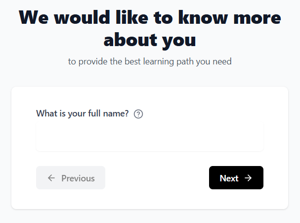
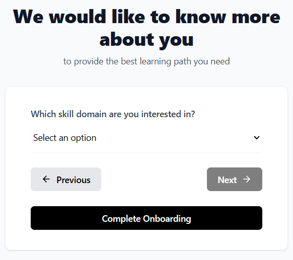
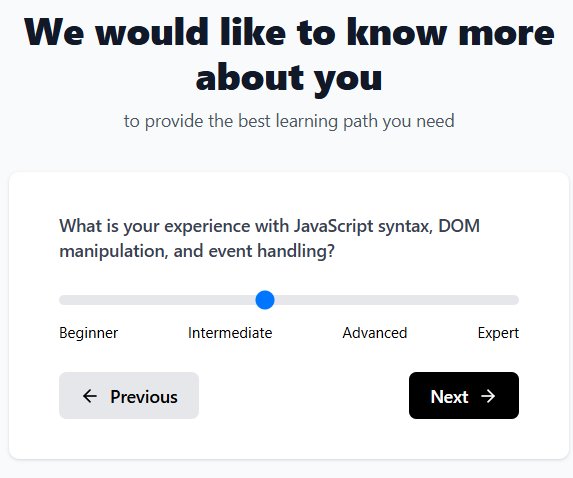
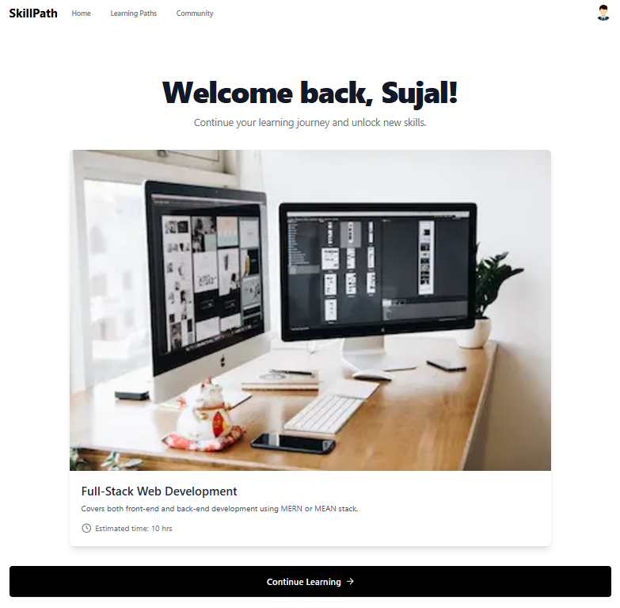
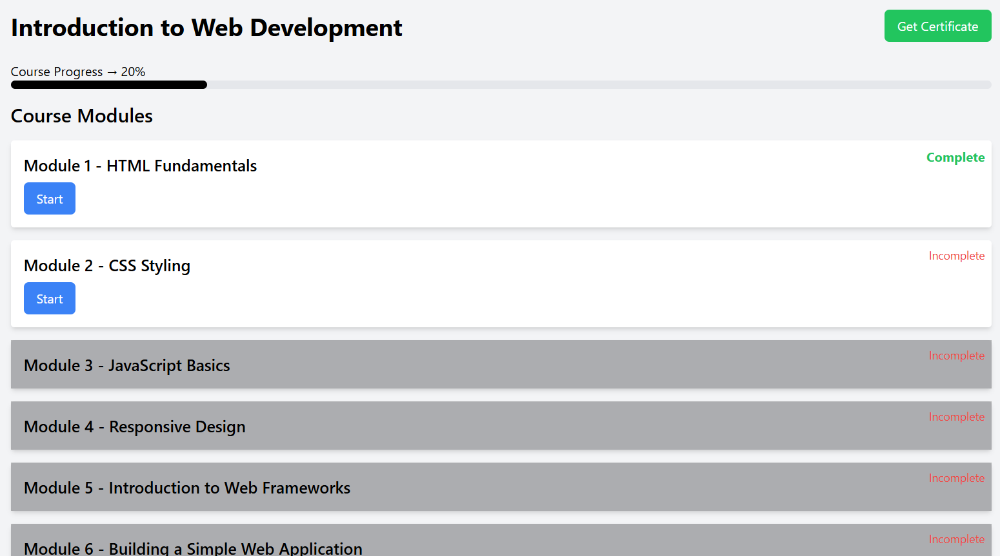
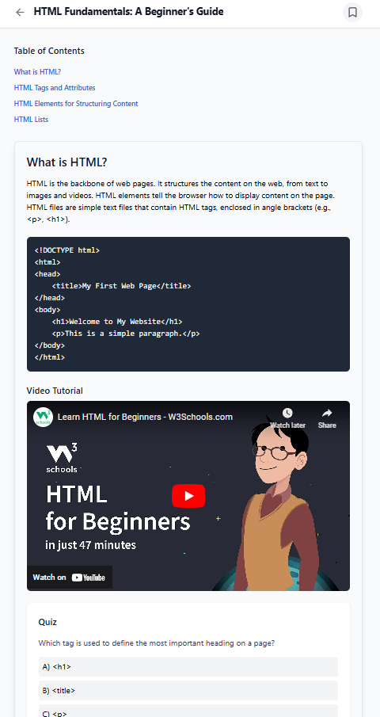
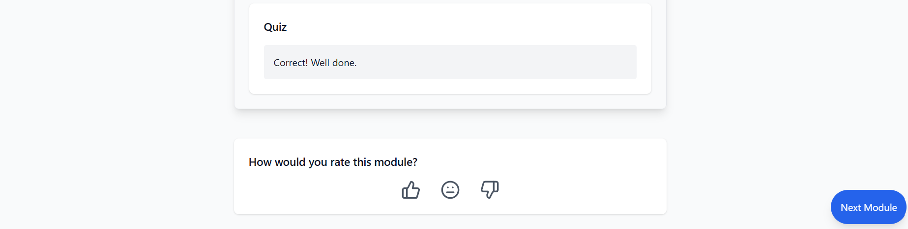

# Personalized Learning Platform


A personalized learning platform that tailors courses to users based on their skillset preferences and onboarding responses. The application dynamically adjusts module difficulty based on user performance, ensuring a structured and effective learning experience.

---

## Project Owner
   ### Sujal Soni
   

Sujal Soni is a final-year Computer Science Engineering student at Medi-Caps University with a passion for full-stack web development. With hands-on experience in modern technologies like React.js, Next.js, Node.js, MongoDB, and Firebase, Sujal has consistently demonstrated his ability to create scalable and user-centric web applications 🌐.

He has successfully delivered impactful projects, such as EventSphere, a dynamic event management platform, and EstateVerse, a real estate app focused on special offers. His technical expertise extends to implementing secure payment gateways using Razorpay and leveraging Google Cloud services like Firebase Authentication, Firestore, and Google Places API for enhanced functionality and seamless user experiences 🧑🏻‍💻

Sujal’s professional journey includes internships at NotesEra and Indo-Tech, where he contributed to building robust front-end and full-stack solutions, optimizing performance, and enhancing user engagement. Beyond his technical skills, Sujal has been an active contributor to the open-source community as a GDSC Open Source Mentor and Hacktoberfest Top Contributor 🗒️

With strong communication, teamwork, and management skills, Sujal excels in collaborative environments and thrives on tackling challenges with innovative solutions. His forward-thinking mindset and dedication to learning make him a valuable asset to any team.

---

## Key Features

- **Dynamic Course Recommendations**: Suggests courses based on user answers during onboarding.
- **Adaptive Learning**: Automatically adjusts module difficulty based on user performance and feedback.
- **Structured Learning Path**: Provides a progressive sequence of modules tailored to the user's learning level.
- **Customizable Difficulty**: Users can influence module difficulty based on their feedback and quiz outcomes.

---

## Tech Stack

- **Frontend**: [Next.js](https://nextjs.org/) - A React framework for building fast, scalable web applications.
- **Backend & Database**: [Firebase Firestore](https://firebase.google.com/docs/firestore) - NoSQL database for real-time data storage and retrieval.
- **Authentication**: [Firebase Authentication](https://firebase.google.com/docs/auth) - Secure Google Sign-In for user authentication.
- **Storage**: [Google Cloud Storage](https://cloud.google.com/storage) - Handles image and file uploads for the platform.

---

## Screenshots

### Onboarding Flow

<br/>

<br/>

<br/><br/>

### Course Recommendation

<br/><br/>

### Module Progress and Feedback

<br/><br/>

### Module Images

<br/>



---


## Installation and Setup

### Prerequisites

1. [Node.js](https://nodejs.org/) installed.
2. Firebase project setup with Firestore, Authentication, and Cloud Storage.

### Installation Steps

1. Fork this repository.

2. Clone the repository:
   ```bash
   git clone https://github.com/SkillPath.git
   cd your-repo-name
   ```

3. Install dependencies:
   ```bash
   npm install
   ```

4. Set up environment variables:
   - Create a `.env.local` file in the root directory.
   - Add Firebase configuration:
     ```makefile
     NEXT_PUBLIC_FIREBASE_API_KEY=your-api-key
     NEXT_PUBLIC_FIREBASE_AUTH_DOMAIN=your-auth-domain
     NEXT_PUBLIC_FIREBASE_PROJECT_ID=your-project-id
     NEXT_PUBLIC_FIREBASE_STORAGE_BUCKET=your-storage-bucket
     NEXT_PUBLIC_FIREBASE_MESSAGING_SENDER_ID=your-messaging-sender-id
     NEXT_PUBLIC_FIREBASE_APP_ID=your-app-id
     ```

5. Run the development server:
     ```bash
     npm run dev
     ```

6. Open your browser and navigate to:
     ```bash
     http://localhost:3000
     ```

---

## Deployment
To deploy the application, follow these steps:

1. Build the application:
   ```bash
   npm run build
   ```

2. Start the production server:
   ```bash
   npm run start
   ```

3. Alternatively, deploy to a cloud hosting service such as Vercel or Firebase Hosting.


---

## Project Structure
   ```
   └── skillpath/
      ├── .next/
      ├── node_modules/
      └── src/
      ├── .env.local
      ├── firebase.js
      └── dashboard.js
      ├── jsconfig.json
      └── package.json
   ```

### Inside src folder:
   - components/: Contains reusable React components.
   - page.js/: This project uses App Router to arrange each page code inside page.js file.
   - public/: Static assets like images and files.
   - styles/: CSS modules for styling.
   - utils/: Utility functions.


---

### Commands

| **Command**   | **Description**                          |
|---------------|------------------------------------------|
| npm run dev   | Starts the development server.           |
| npm run build | Builds the application for production.   |
| npm run start | Runs the application in production mode. |


---

### Contributing
Contributions are welcome! Please fork the repository and create a pull request.
<br/>
Check out **<code><a href="https://github.com/Sujal-2820/SkillPath/blob/main/CONTRIBUTING.md">CONTRIBUTING.md</a></code>** for a comprehensive guide on the contribution process.

---

### NOTE
   - Raising an "issue" first would increase the chances of your pull request being noticed.
   - You can raise an issue to ask for .env.local file as it holds the necessary credentials for Firebase.
   - The project requires a ```secret``` file (apart from ```.env.local```) in order to fetch the content from "Cloud Storage" of "Google Cloud Platform". This shall be provided to you if asked for the same.

---

### Scope of Contribution
   - This project particularly seeks improvement in the JSON content inside each file of ```courseFolder```. The JSON forms the basis of module data that is presented inside a particular course 📝.
   - If you are someone who has got a good knowledge of Next JS, you are free to raise an issue and eventually a pull request of your solution/modifications to the code which could enhance the UI of the project 🌄
   - Even your smallest contribution counts. You will be credited inside both the project as well as in the repository 🧑🏻‍💻.


---

### Contact
For any inquiries, please reach out to:

Email: sujal99ds@gmail.com
<br/>
GitHub: https://github.com/Sujal-2820
<br/>
LinkedIn: https://www.linkedin.com/in/sujal-soni/
