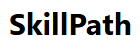

# Personalized Learning Platform



A personalized learning platform that tailors courses to users based on their skillset preferences and onboarding responses. The application dynamically adjusts module difficulty based on user performance, ensuring a structured and effective learning experience.

---

## Key Features

- **Dynamic Course Recommendations**: Suggests courses based on user answers during onboarding.
- **Adaptive Learning**: Automatically adjusts module difficulty based on user performance and feedback.
- **Structured Learning Path**: Provides a progressive sequence of modules tailored to the user's learning level.
- **Customizable Difficulty**: Users can influence module difficulty based on their feedback and quiz outcomes.

---

## Tech Stack

- **Frontend**: [Next.js](https://nextjs.org/) - A React framework for building fast, scalable web applications.
- **Backend & Database**: [Firebase Firestore](https://firebase.google.com/docs/firestore) - NoSQL database for real-time data storage and retrieval.
- **Authentication**: [Firebase Authentication](https://firebase.google.com/docs/auth) - Secure Google Sign-In for user authentication.
- **Storage**: [Google Cloud Storage](https://cloud.google.com/storage) - Handles image and file uploads for the platform.

---

## Screenshots

### Onboarding Flow


### Course Recommendation


### Module Progress and Feedback


---

## Installation and Setup

### Prerequisites

1. [Node.js](https://nodejs.org/) installed.
2. Firebase project setup with Firestore, Authentication, and Cloud Storage.

### Installation Steps

1. Clone the repository:
   ```bash
   git clone https://github.com/your-repo-name.git
   cd your-repo-name
   ```
